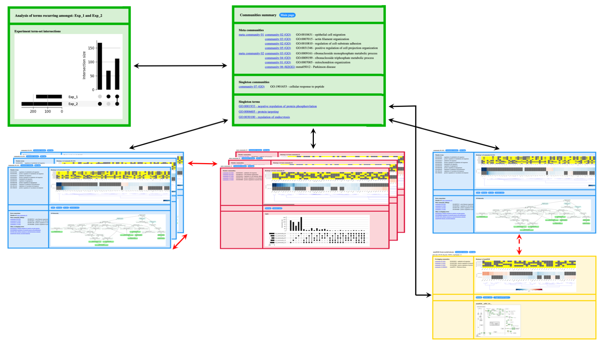

# User Guide


### Installation

#### Option 1: Don't install! Instead, download the GeneFEAST ready-to-use [Docker](https://docs.docker.com/get-docker/) container!

To download the latest container from the [repository](https://github.com/avigailtaylor/GeneFEAST/pkgs/container/genefeast):
```
docker pull ghcr.io/avigailtaylor/genefeast:latest
```
<br>

<blockquote>
This Docker image is designed for “standard Docker installations” on hosts with AMD64 and ARM64 CPUs.
</blockquote>

<br>

#### Option 2:  Locally install the package and its dependencies

<ol>
<li><a href="https://docs.python.org/3.12/using/index.html">Install Python 3.12</a></li>
<li><a href="https://graphviz.org/download/">Install Graphviz</a></li>
<li><a href="https://packaging.python.org/en/latest/guides/installing-using-pip-and-virtual-environments/#creating-a-virtual-environment">Create and activate a virtual environment</a></li>
<br>
<blockquote>
<b>IMPORTANT</b>
<ul>
  <li>We <b>strongly recommend</b> installing GeneFEAST in a <b>virtual environment</b> because of its <a href="dependencies_and_requirements.md">dependencies and requirements</a>.</li>
  <li><b>Make sure to</b> create a virtual environment using <b>Python 3.12 explicitly</b>, rather than your computer's default version.</li>
</ul>
</blockquote>

<li>Install the most recent version of setuptools:</li>
<ul>
<li>Unix/macOS: `pip install --upgrade setuptools`</li>
<li>Windows: `py -m pip install --upgrade setuptools`</li>
</ul>
<li>Install GeneFEAST:</li>
<ul>
<li>Unix/macOS: `pip install genefeast`</li>
<li>Windows: `py -m pip install genefeast`</li>
</ul>
</ol>

<br>

<hr>


### Setup

#### To run GeneFEAST, you will need:

<details>
<summary>Functional enrichment analysis (FEA) results file(s)</summary>
<br>
<ul>
<li>contain the results of a FEA conducted on a list of genes of interest (GoI).</li>
<li>should be in CSV file format.</li>
<li>should have the following four columns, in this order:</li>
</ul>

<br>
<table>
  <tr><td><b>Type</b></td><td><b>ID</b></td><td><b>Description</b></td><td><b>GeneID</b></td></tr>
</table>
<br>
<blockquote>
  <ul>
    <li>Type: Term type/originating database</li>
    <li>ID: Term ID in database</li>
    <li>Description: Term description</li>
    <li>GeneID: "/"-separated list of gene IDs corresponding to GoIs annotated by the term</li>
    <ul>
      <li>Note that in a GSEA-type FEA this is known as the term's <i>leading edge</i> subset</li>
    </ul>
  </ul>
</blockquote>
<br>
<details>
   <summary>Example</summary>
  
<table>
  <tr><td><b>Type</b></td><td><b>ID</b></td><td><b>Description</b></td><td><b>GeneID</b></td></tr>
  <tr>
    <td>"GO"</td>
    <td>"GO:0071774"</td>
    <td>"response to fibroblast growth factor"</td>
    <td>"CCN2/THBS1/EGR3/FGF2/SPRY4/<br>NDST1/CCL2/IER2/FLRT3/PRKD2/<br>CXCL8/SPRY2/FRS2/FGFR1/SPRY1/<br>RUNX2/HYAL1/KDM5B/NOG/ZFP36L1/<br>COL1A1/CASR/FGFR3/FGF1/EXT1/<br>FGFBP1/GATA3/NR4A1"</td>
  </tr>
  <tr>
    <td>"GO"</td>
    <td>"GO:0002294"</td>
    <td>"CD4-positive alpha-beta T cell differentiation involved in immune response"</td>
    <td>"RARA/BCL6/SMAD7/SOCS3/PTGER4/<br>JUNB/ZC3H12A/FOXP1/ENTPD7/NFKBIZ/<br>NLRP3/RC3H1/RORC/RIPK2/ANXA1/<br>RELB/MYB/IL6/LGALS9/GATA3"</td>
  </tr>
  <tr>
    <td>"GO"</td>
    <td>"GO:2000514"</td>
    <td>"regulation of CD4-positive alpha-beta T cell activation"</td>
    <td>"RARA/BCL6/SMAD7/JUNB/RUNX1/<br>ZC3H12A/NFKBIZ/NLRP3/RC3H1/CD274/<br>CBLB/RIPK2/ANXA1/AGER/RUNX3/<br>SOCS1/VSIR/PRKCQ/LGALS9/GATA3"</td>
  </tr>
</table>

<br>
The corresponding table in CSV format:

<pre>
<code>
Type,ID,Description,GeneID    
"GO","GO:0071774","response to fibroblast growth factor","CCN2/THBS1/EGR3/FGF2/SPRY4/NDST1/CCL2/IER2/FLRT3/PRKD2/CXCL8/SPRY2/FRS2/FGFR1/SPRY1/RUNX2/HYAL1/KDM5B/NOG/ZFP36L1/COL1A1/CASR/FGFR3/FGF1/EXT1/FGFBP1/GATA3/NR4A1"
"GO","GO:0002294","CD4-positive alpha-beta T cell differentiation involved in immune response","RARA/BCL6/SMAD7/SOCS3/PTGER4/JUNB/ZC3H12A/FOXP1/ENTPD7/NFKBIZ/NLRP3/RC3H1/RORC/RIPK2/ANXA1/RELB/MYB/IL6/LGALS9/GATA3"
"GO","GO:2000514","regulation of CD4-positive alpha-beta T cell activation","RARA/BCL6/SMAD7/JUNB/RUNX1/ZC3H12A/NFKBIZ/NLRP3/RC3H1/CD274/CBLB/RIPK2/ANXA1/AGER/RUNX3/SOCS1/VSIR/PRKCQ/LGALS9/GATA3"
</code>
</pre>

</details>
<hr>
</details>

<details>
<summary>Genes of interest (GoI) file(s)</summary>
<br>
<ul>
<li>contain the list of GoI that served as input for the FEA being summarised.</li>
<li>should be in CSV file format.</li>
<li>should contain one GoI per line, each with a corresponding quantitative value derived from the high-throughput 'omics experiment from which the GoI were also identified.</li>
</ul>
<br>
<blockquote>
<b>IMPORTANT</b>
<ul>
  <li>GoI <b>must</b> be listed using <b>IDs that match those used in the FEA results file</b>.</li>
  <li>If you do not have quantitative data, you can just provide a dummy column with the same <i>numerical</i> value entered for each gene.</li>
</ul>
</blockquote>

<br>

  <details>
   <summary>Example</summary>
<br>
  <table>
      <tr><td><b>GeneID</b></td><td><b>log2FC</b></td></tr>
       <tr><td>PDGFB</td><td>2.845276684</td></tr>
       <tr><td>GTPBP4</td><td>1.396754262</td></tr>
       <tr><td>C12orf49</td><td>1.469143469</td></tr>
       <tr><td>SLC2A1</td><td>1.618759309</td></tr>
       <tr><td>CCN2</td><td>2.593769464</td></tr>
       <tr><td>CXCR4</td><td>2.528192609</td></tr>
       <tr><td>NCOA5</td><td>2.137989231</td></tr>
       <tr><td>CDKN1A</td><td>3.154969844</td></tr>
       <tr><td>RARA</td><td>1.444539048</td></tr>
  </table>
<br>
    
The corresponding table in CSV format:

<pre>
<code>
GeneID,log2FC
PDGFB,2.845276684
GTPBP4,1.396754262
C12orf49,1.469143469
SLC2A1,1.618759309
CCN2,2.593769464
CXCR4,2.528192609
NCOA5,2.137989231
CDKN1A,3.154969844
RARA,1.444539048
</code>
</pre>

</details>
<br>

<details>
<summary>IMPORTANT README FOR ORA-type FEAs</summary>
<blockquote>
<ul>
  <li>GoI files can contain just significantly differentially expressed genes, <b>or</b> they can contain results for all genes tested in a given experiment.</li>
  <li>Either way, GeneFEAST will only store quantitative data for GoI that are also present in the FEA results file for the corresponding experiment.</li>
</ul>
</blockquote>
</details>
<br>

<details>
  <summary>IMPORTANT README FOR GSEA-type FEAs</summary>
<blockquote>
<ul>
  <li>Since, by definition, GSEA-type FEAs do not select a subset of genes for analysis, the GoI file in this scenario is just the results for all genes tested in a given experiment.</li>
  <li>Importantly, GeneFEAST will only store quantitative data for genes present in at least one leading edge subset in the GSEA-type FEA results file, and it is this set of genes that are considered as <i>de facto</i> GoI for the rest of the GeneFEAST analysis.</li>
</ul>
<br>
<b>IMPORTANT NOTE ABOUT BEST PRACTICE FOR GENEFEAST ANALYSIS OF GSEA-TYPE FEAs</b>
<ul>
  <li>Standard GSEAs look for enrichment of gene-sets amongst <b>either</b> the most over-expressed <b>or</b> the most under-expressed genes in a list of genes ranked by expression.</li>
  <li>Thus, for any significantly enriched term, <b>either</b> a positive enrichment score (corresponding to enrichment amongst over-expressed genes) <b>or</b> a negative enrichment score (corresponding to enrichment amongst under-expressed genes) is reported, <b>but never both</b>.</li>
  <li>Consequently, in the GeneFEAST setting, you should <b>split your GSEA results into two FEA results files:</b> one for positive scoring terms and one for negative scoring terms, then treat these as <b>separate FEA results files</b> for GeneFEAST summarisation purposes.</li>
</ul>
</blockquote>
</details>
<br>
<hr>
</details>

<details>
   <summary>A YAML setup file</summary>
   <br>
   <p>You will use this setup file to give GeneFEAST the id(s) of the FEA(s) to summarise, the location(s) of the FEA file(s), and the location(s) of the GoI file(s).</p>

To summarise a single FEA:

<pre><code>
FEAs:
    - id: "FEA_1"
      goi_file: "goi_file_for_FEA_1"
      fea_file: "FEA_1_results_file"
</code></pre>

<br>
To summarise multiple FEAs (e.g. three FEAs):

<pre><code>
FEAs:
    - id: "FEA_1"
      goi_file: "goi_file_for_FEA_1"
      fea_file: "FEA_1_results_file"

    - id: "FEA_2"
      goi_file: "goi_file_for_FEA_2"
      fea_file: "FEA_2_results_file"

    - id: "FEA_3"
      goi_file: "goi_file_for_FEA_3"
      fea_file: "FEA_3_results_file"
</code></pre>
  
   You can create a YAML setup file using <a href="https://avigailtaylor.github.io/GeneFEAST/setup_template.yml">this template</a>.
<hr>
</details>

<br>

#### In addition, you can also provide GeneFEAST with:
<details>
  <summary>An FEA results file outputted by one of the 'enrich' family of functions available from the <a href="https://rdrr.io/bioc/clusterProfiler/man/">clusterProfiler R package</a>. This is <b>instead of</b> the basic FEA results file described above and is useful if you want GeneFEAST to create dot plots of your FEA results.</summary>
  <br>
  
<table>
  <tr>
    <td><b>Type</b></td><td><b>ID</b></td><td><b>Description</b></td>
    <td><b>GeneRatio</b></td><td><b>BgRatio</b></td><td><b>pvalue</b></td>
    <td><b>p.adjust</b></td><td><b>qvalue</b></td><td><b>GeneID</b></td><td><b>count</b></td>
  </tr>
</table>

<br>
<blockquote>
<b>IMPORTANT</b>
<ul>
  <li>Columns ID through to count are output by the enrich functions.</li>
  <li>However, <b>you will need to add the "Type" column manually</b>, e.g., using Excel or VIM.</li>
</ul>
</blockquote>


<br>

When using 'enrich'-formatted FEA results, you will need to add the following line to your YAML setup file:

<pre><code>
ENRICH: True
</code></pre>

<br>

You can then also add this line if you want GeneFEAST to output dot plots of your FEA results:

<pre><code>
DOTPLOTS: True
</code></pre>

<br>

<p>You can create a setup YAML file with these additional lines of code using <a href="https://avigailtaylor.github.io/GeneFEAST/setup_template_2.yml">this template</a>.</p>

<hr>
</details>


<details>
  <summary>Search terms to look up alongside your GoI.</summary>
  <br>

<p>As part of the report generation process, GeneFEAST conducts a literature search for each GoI via the National Center for Biotechnology Information's Gene and PubMed services (Sayers, et al., 2021).</p> 
<br>
<p>This literature search can incorporate additional search terms, which you can specify in your YAML setup file using the following code:</p>
<br>

<pre><code>
SEARCH_WORDS:
- search term 1
- search term 2
- etc.
</code></pre>

<br>
<p>You can create a setup YAML file with these additional lines of code using <a href="https://avigailtaylor.github.io/GeneFEAST/setup_template_3.yml">this template</a>.</p>

<hr>
</details>

<details>
  <summary>Extra annotations for genes.</summary>
  <br>

<p>Occasionally, you may wish to keep track of an <i>a priori</i> set of genes relevant to your study, for example those that are members of a particular biological signature, throughout the GeneFEAST report.</p>

<br>

<p>Each extra annotation will be displayed as an additional row at the top of the term-GoI heatmap panel in the <a href="https://avigailtaylor.github.io/GeneFEAST/split_heatmaps.md">split heatmap</a> created for each community of terms 
(similarly for each meta community of communities).</p>

<br>

<p>To do this, first make an extra annotation (EA) file. The EA file is a headerless CSV file, with one EA per row, and two columns:</p>

<ol>
<li>Extra annotation name.</li>
<li>"/"-separated list of gene IDs to be labelled with the EA.</li>
</ol>
<br>

Example EA file:

<pre><code>
RNA_DRG_IFN,STAT1/IFI16/SP110/MX1/IFIT5/PARP12/EIF2AK2/IFI44/PARP14/TRIM21/DDX60L/IFI127/ADAR/HERC6/IFI35/ISG20/LGALS9/UBE2L6/DHX58/STAT2/OAS3/ISG15/IRF7/IFI6/IFI44L/IFITM1/OAS1/D$
Proteome_DRG_IFN,IFIT2/IFIT1/IFIT3/OAS2/MX2/OASL/IFIH1/ISG15/MX1/SP110/IFI44/CMPK2/IFI44L/OAS1/DDX58/STAT1/IFIT5/DDX60/PARP12/IFI16/DDX60L/OAS3/EIF2AK2/ISG20/ADAR/IFI35/STAT2/LGAL$
</code></pre>

<br>
<p>Then, add this line of code to your setup YAML file:</p>

<pre><code>
EA_FILE: extra_annotation_file
</code></pre>

You can create a setup YAML file with these additional lines of code using <a href="https://avigailtaylor.github.io/GeneFEAST/setup_template_4.yml">this template</a>.

<hr>
</details>

<details>

  
<summary>Pre-made PNG images for significantly enriched/over-represented terms.</summary>
<br>
<p>For example, if KEGG pathway images have been generated as part of the FEA, these images can be incorporated into the report.</p>

<br>
<p>For each FEA being summarised you have the option of providing a directory (folder) containing <b>at most one image</b> for each enriched term identified in that FEA.</p>

<br>

<p>In the setup YAML file, do this by specifying the image directory for an FEA by adding the field "input_image_dir" to that FEA's record:</p>
<br>
<pre><code>
FEAs:
    - id: "FEA_1"
      goi_file: "goi_file_for_FEA_1"
      fea_file: "FEA_1_results_file"
      input_img_dir: "image_directory_for_FEA_1"
</code></pre>

<br>
<p>You can create a setup YAML file with this additional lines of code using <a href="https://avigailtaylor.github.io/GeneFEAST/setup_template_5.yml">this template</a></p>

<br>

<blockquote>
<b>IMPORTANT</b>
<ul>
  <li>GeneFEAST automatically generates a GO hierarchy for all terms with a Type string starting "GO" (or "go", "Go", and "gO"; case is ignored). So, if you provide a corresponding image for such a term, this will be ignored. The work around here, should you wish to provide alternative images for GO terms, is to change their Type field in the FEA file to be something other than a string starting with "GO" (or "go", "Go", and "gO").</li>
  <li>Similarly, for MSIGDB terms, GeneFEAST will always try to include an HTML tabular description of the term, and any provided image will be ignored. As for GO terms, the work around here is to change the Type field in the FEA file to be something other than a string starting with "MSIGDB" (or any other case variant).</li>
</ul>
</blockquote>

<hr>
</details>

<details>
<summary>A GO OBO file.</summary>
<br>
<p>GeneFEAST ships with a GO OBO file, but if you want to provide a more recent version of this yourself, you can do so in the setup YAML file by adding this line of code:</p>
<br>
<pre><code>
OBO_FILE: "GO_OBO_file"
</code></pre>

<hr>
</details>


<details>
<summary>MSIGDB HTML file.</summary>
<br>
<p>GeneFEAST ships with an MSIGDB HTML file containing an HTML tabular summary of each MSIGDB term, but if you want to provide a more recent version of this yourself, you can do so in the setup YAML file by adding this line of code:</p>
<br>
<pre><code>
MSIGDB_HTML: "MSIGDB_HTML_file"
</code></pre>

<hr>
</details>


<details>
<summary>GeneFEAST parameters</summary>

<br>

<p>GeneFEAST runs with preconfigured parameter settings for summarising and visualising FEA results from bulk RNASeq experiments. However, parameters can be over-written to potentially get better performance tailored to the user's FEA(s).</p>

<br>

<details>

<summary>Click here to see the list of parameters which can be set in the setup YAML file.</summary>

<br>
<b>Parameters are shown with their default values</b>

<br>

<pre><code>

# **************************************************************************************************************************
# *** Parameters for filtering terms prior to summarisation ***
# **************************************************************************************************************************

MIN_NUM_GENES: 10
# Number of genes of interest that a term must annotate in order to be included in the GeneFEAST report.

MAX_DCNT: 50
MIN_LEVEL: 3
# These parameters pertain to GO terms. 
# MAX_DCNT means maximum descendant count allowed for a GO term to be included in the GeneFEAST summary report.
# MIN_LEVEL means the minimum level in the GO hierarchy that GO term must have to be included in the GeneFEAST summary report.
# Please refer to article https://doi.org/10.1038/s41598-018-28948-z for further explanation of these terms.

# **************************************************************************************************************************
# *** Parameters affecting how terms and communities are clustered into communities and meta communities, respectively ***
# **************************************************************************************************************************

TT_OVERLAP_MEASURE: OC
# Overlap measure to use when calculating the gene set overlap between terms. Two values are recognised:
# OC (Overlap Coefficient)
# JI (Jaccard Index)
# We recommend using OC here.

MIN_WEIGHT_TT_EDGE: 0.5
# Minimum gene set overlap between terms (as measured using TT_OVERLAP_MEASURE) required for two terms to be
# connected (i.e. to have an edge between them) in the term-term network that GeneFEAST constructs prior to finding
# communities of terms. (Please see GeneFEAST paper for further details).

SC_BC_OVERLAP_MEASURE: OC
# Overlap measure to use when calculating the gene set overlap between a term and a community of terms. Two values are recognised:
# OC (Overlap Coefficient)
# JI (Jaccard Index)
# We recommend using OC here.

MIN_WEIGHT_SC_BC: 0.25
# Minimum gene set overlap required between a term and a community of terms for that term to be considered weakly connected
# to the community of terms (i.e. having some connectivtity to the community, but not enough to be considered part of that community).

BC_BC_OVERLAP_MEASURE: JI
# Overlap measure to use when calculating the gene set overlap between two communities of terms. Two values are recognised:
# OC (Overlap Coefficient)
# JI (Jaccard Index)
# We recommend using JI here.

MIN_WEIGHT_BC_BC: 0.1
# Minimum gene set overlap required between two communities of terms for those two communities to be connected (i.e. to 
# have an edge between them) in the community-community network that GeneFEAST constructs prior to finding
# meta-communities of communities. (Please see GeneFEAST paper for further details).

MAX_COMMUNITY_SIZE_THRESH: 15
MAX_META_COMMUNITY_SIZE_THRESH: 15
# In GeneFEAST, the size communities and meta communities is attenuated using an adaptive algorithm (see main paper for details).
# These two values are parameters for the adaptive algorithm, which will ensure that community and meta-community sizes do
# not exceed these thresholds.

COMBINE_TERM_TYPES: False
# If you are using GeneFEAST to summarize terms from multiple databases, such that the set of terms to be summarised contains more than one type,
# then you can choose either to only allow clustering of terms when terms are from the same database/ share their type (COMBINE_TERM_TYPES: False),
# or to allow the clustering of terms into communities comprised of terms from different databases (COMBINE_TERM_TYPES: True).


# **************************************************************************************************************************
# *** Parameters affecting display of heatmaps ***
# **************************************************************************************************************************

QUANT_DATA_TYPE: log2 FC
# This is the label for the colourmap legend in the split heatmaps

HEATMAP_WIDTH_MIN: 10
HEATMAP_HEIGHT_MIN: 6.5
# These parameters control the size of the split heatmaps. These may need adjusting depending on the size of your display.

HEATMAP_MIN: -4
HEATMAP_MAX: 4
# These parameters give the range of values expected for the provided quantitative data type, and will be used to set the scale
# for the colourmap used in the split heatmap. You should adjust these to match your data. In the case that you do not have 
# quantitative data for your genes of interest and have replaced this column with a singular, dummy, variable, you should set these
# values so that your dummy value is in the range.

# **************************************************************************************************************************
# *** Parameters affecting HTML report ***
# **************************************************************************************************************************

TOOLTIPS: False
# If set to True, the HTML report will be rendered with tooltips to help the novice user better understand the report's contents.

DEFAULT_META_VIEW: circos
# This parameter sets the default first plot shown for meta communities. Accepted values are: "circos","upset","heatmapa","heatmapb","heatmapc", and "litsearch".

DEFAULT_COMMUNITY_VIEW: circos
# This parameter sets the default first plot shown for communities. Accepted values are: "circos","upset","heatmapa","heatmapb","heatmapc", and "litsearch".

</code></pre>

</details>
</details>

<br>
<hr>

### Running GeneFEAST

Below are simple/quick-start instructions for setting up and running GeneFEAST. Users with more computational experience can refer to the note at the [end of this section](#advanced).

<br>

#### Setting up your GeneFEAST project directory (folder)

Start by making your GeneFEAST project directory (folder) and navigating there. For example, in Linux:

```bash
mkdir my_genefeast_project
cd my_genefeast_project
```

<br>

Next, copy the following files to this directory:
<ul>
  <li>fea_file(s)</li>
  <li>goi_file(s)</li>
</ul>

<br>

<p>For example, in Linux, use the following commands to copy your fea_file and goi_file from their original locations to your GeneFEAST project directory:</p>

```bash
cp /full/path/to/fea_file .
cp /full/path/to/goi_file .

# The precondition for these cp commands is that they are called from inside your GeneFEAST project directory.
```

<br>

(Optional) Also copy over the following, as needed:
<ul>
  <li>extra_annotation_file</li>
  <li>image_directory_for_FEA (you can have up to one image directory file per FEA being summarised)</li> 
  <li>GO_OBO_file</li>
  <li>MSIGDB_file</li>
</ul>

<br>

Now create your setup YAML file (you can use <a href="https://avigailtaylor.github.io/GeneFEAST/setup_template.yml">this template</a>), and also save it in your GeneFEAST project directory.

<br>
<hr>

<mark>You are now ready to run GeneFEAST! Stay in your GeneFEAST project directory and run GeneFEAST using one of the following options:</mark>

<hr>

<br>

#### Running GeneFEAST from a Docker container

```bash
  docker run --rm -v ${PWD}:/data -w /data ghcr.io/avigailtaylor/genefeast gf <SETUP_YAML_FILE> <OUTPUT_DIR>

  # The precondition for this command is that the setup YAML file and data files are located in directory ${PWD}.
  # (Technical note for more advanced users: the -v flag is bind-mounting directory ${PWD} on the host machine to the directory called data in the container.)
```
<br>
    
#### Running GeneFEAST from installation

If you have installed GeneFEAST, then you can run it on the command line or from inside a Python session.

##### Command line:

```bash
gf <SETUP_YAML_FILE> <OUTPUT_DIR> 
```

##### Python session:

```python
from genefeast import gf

gf.gf(<SETUP_YAML_FILE>, <OUTPUT_DIR>)
```

<br>
<blockquote>
<b>NOTES</b>
<ul>
<li>When you run GeneFEAST, it will use the setup YAML file to count how many FEAs are being summarised, and then generate single or multi FEA summary reports accordingly.</li>
<li>Make sure &lt;OUTPUT_DIR&gt;  does not already exist.</li>
</ul>
</blockquote>

<br>
<br>

<details>
  <summary><b><a name="advanced">A note for users with more computational experience on the use of file paths when calling GeneFeast.</a></b></summary>

  <br>

  <p><i>If, like me, you prefer to use a directory structure that separates code, input, and output, that's absolutely fine. If you know what you're
  doing you can replace file names with file paths, in either or both of the main call to GeneFEAST and the setup YAML file, and GeneFEAST will know
  what to do....I've presented the simplest process above so that all users can get started with GeneFEAST!</i></p>
  
  <p><i>On an extra technical note - if you're using GeneFEAST via its Docker container please do make sure that all the directories referenced in your GeneFEAST call and setup YAML file are 
    bind-mounted to the correct directory on the host computer :)</i></p>
</details>

<hr>

<br>

### Viewing the GeneFEAST report

##### Single FEA summary report
To view a GeneFEAST single FEA summary report, navigate to the output directory (specified by you in the `<OUTPUT_DIR>` parameter, above) and use a web browser to open 
file `<FEA_IDENTIFIER>_communities_summary.html`.

<br>

##### Multi FEA summary report

To view a GeneFEAST multi FEA summary report, navigate to the output directory and use a web browser to open file `<FEA_IDENTIFIERS>_main.html`.

<br>

<blockquote>
<b>IMPORTANT</b>
<ul>
<li>Viewing the HTML output report requires a web-browser with HTML5 and JavaScript 1.6 support.</li>
<li>Please make sure to keep all the output generated by GeneFEAST in the output directory; the HTML report uses relative links to images, and will <b>break</b> if the relative directory structure is broken.</li>
</ul>
</blockquote>

<br>

<hr>

### Navigating the GeneFEAST report

The figure below summarises the structure of HTML reports generated by GeneFEAST:


<br>

<p><b>Reports summarising one FEA</b> have a 'Communities overview' homepage (grey inset), which provides a list of communities (green frame in grey inset), a <a href="https://github.com/avigailtaylor/GeneFEAST/blob/main/sil_plot.md">silhouette plot of communities</a> (i), and a <a href="https://github.com/avigailtaylor/GeneFEAST/blob/main/graphical_grid_search.md">graphical grid search of community detection parameters</a> (ii). The Communities overview homepage has the following anchor links (black, solid arrows) into the ‘Full report’: 
<ul>
  <li>a link for each meta community (red frames);</li>
  <li>a separate link to each member community therein (blue frames, bottom left);</li>
  <li>links to communities of enriched terms that did not form part of a larger meta community (isolated blue frame, right);</li>
  <li>and links to terms that did not form part of an enriched-term community (yellow frame).</li>
</ul>  

A top navigation bar with ‘Communities overview’ and ‘Full report’ dropdown menus is fixed at the top of the report and always visible. This provides direct access to every part of the report at all times, </p>

<p><b>Reports summarising multiple FEAs</b> start with a front page showing an upset plot of the sets of terms identified as enriched in each of the input FEAs (top left green frame). We refer to each set of terms found in two or more FEAs as a "FEA term-set intersection". The navigation bar at the top of this front page provides a ‘Reports’ dropdown menu from which the user can navigate to separate reports summarising the terms in each FEA term-set intersection. Each of the separate reports has the structure of a report summarising a single FEA, as described above.</p>

<p>For each <b>community</b> of enriched terms, GeneFEAST reports:
<ul>
<li>member terms;</li>
<li>a <a href="https://github.com/avigailtaylor/GeneFEAST/blob/main/circos_and_upset.md">circos plot and an upset plot</a> showing the overlap between sets of genes annotated by the member terms;</li>
<li><a href="https://github.com/avigailtaylor/GeneFEAST/blob/main/split_heatmaps.md">split heatmaps</a> of the term- and experiment-GoI relationships and gene-level quantitative data, as well as extra annotations, if supplied;</li>
<li>a dot plot summary of member term’s FEA results, if supplied;</li>
<li>further information about terms, such as GO hierarchies and KEGG pathway diagrams;</li>
<li>external hyperlinks to literature searches for each gene of interest, incorporating additional search terms if you have supplied them.</li>
</ul>
Where applicable, community frames have links back to their meta community and also to sibling communities in their meta community (black, dashed arrows); separately, they also have a list of links to terms sharing some gene-set overlap, where that overlap was too weak for membership of the community (black, dotted arrow).</p> 

<p><b>Term</b> frames have similar, reduced content of community frames. In particular, they do not include upset plots and dot plots, and the term-gene heatmap element of their <a href="https://github.com/avigailtaylor/GeneFEAST/blob/main/split_heatmaps.md">split heatmaps</a> is extended to highlight which genes, if any, contribute to enriched terms that have been clustered into a community; in this case the corresponding gene-community pair is depicted in the heatmap. Term frames have links back to weakly connected communities (black, dotted arrow).</p>

<p><b>Meta community</b> frames contain:
<ul>
<li><a href="https://github.com/avigailtaylor/GeneFEAST/blob/main/circos_and_upset.md">circos plot and upset plot</a> showing the gene-set overlap of member communities;</li>
<li><a href="https://github.com/avigailtaylor/GeneFEAST/blob/main/split_heatmaps.md">split heatmaps</a>, wherein term annotation is replaced by gene-community membership in the top heatmap, and <b>only genes present in two or more communities</b> are shown;</li>
<li>external hyperlinks to literature searches for each gene of interest, incorporating additional search terms if you have supplied them.</li>
</ul>
In addition, meta community frames have links to member communities (black, dashed arrow).</p>

<br>

<b>Further information on GeneFEAST report elements:</b>
<ul>
<li><a href="https://github.com/avigailtaylor/GeneFEAST/blob/main/communities_overview.md">Communities overview page</a></li>
</ul>
<ul>
<li><a href="https://github.com/avigailtaylor/GeneFEAST/blob/main/featsi.md">FEA term-set intersection page</a></li>
</ul>
<ul>
<li><a href="https://github.com/avigailtaylor/GeneFEAST/blob/main/community_frame.md">Community frame</a></li>
</ul>
<ul>
<li><a href="https://github.com/avigailtaylor/GeneFEAST/blob/main/meta_community_frame.md">Meta community frame</a></li>
</ul>
<ul>
<li><a href="https://github.com/avigailtaylor/GeneFEAST/blob/main/term_frame.md">Term frame</a></li>
</ul>

<br>

<hr>

### Additional GeneFEAST output

Term-community membership, term- and experiment-GoI relationships are also output in CSV format, for input into downstream programs. The columns are:

- Community (will be empty if a term is not part of a community)
- Meta community (will be empty if a community is not part of a meta community)
- FEA/experiment identifier
- Term
- Gene
- Quantitative data for gene

<br>

<blockquote>
<b>NOTE</b>
<p>This table structure is necessarily repetitive, with possible multiple entries per gene. In particular, each gene has one entry per FEA/experiment-term pair where:</p>
<ul>
<li>the gene was identified as a GoI in the experiment that underwent FEA;</li>
<li>the gene is annotated by the term;</li>
<li>and the term has been identified as significantly enriched in the FEA.</li>
</ul>
</blockquote>
